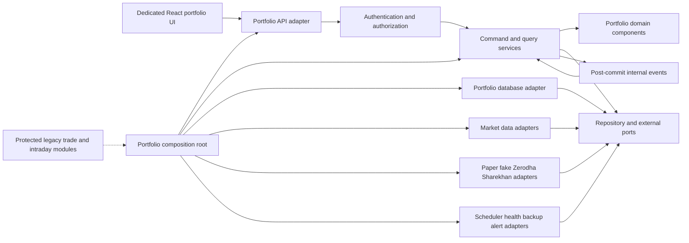
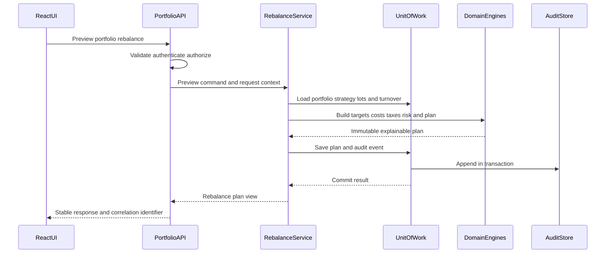

# Component Dependencies

## Dependency Rules

1. Domain components depend only on domain types and policies.
2. Application services depend on domain components and port interfaces.
3. API and React adapters depend on application contracts, never infrastructure details.
4. Infrastructure and external adapters implement ports and may depend on approved libraries.
5. The composition root is the only component that knows concrete implementations.
6. Existing intraday modules do not become dependencies of the portfolio domain.

## Dependency Matrix

| Consumer | Domain | Application | Ports | Persistence | External adapters | API | React UI |
|---|---|---|---|---|---|---|---|
| Domain | Allowed | No | No | No | No | No | No |
| Application | Allowed | Allowed | Allowed | No | No | No | No |
| Persistence | Allowed types | No | Implements | Allowed | No | No | No |
| External adapters | Allowed types | No | Implements | No | Allowed | No | No |
| API adapter | DTOs only | Allowed | No | No | No | Allowed | No |
| React UI | View types | API client only | No | No | No | HTTP only | Allowed |
| Composition root | Allowed | Allowed | Allowed | Allowed | Allowed | Allowed | No |

## Component Graph

### Text Alternative

- The dedicated React portfolio UI calls the portfolio API.
- The API authenticates and authorizes before invoking command and query services.
- Application services coordinate domain components and port interfaces.
- Database, market-data, broker, scheduler, health, backup, and alert adapters implement ports.
- The composition root wires concrete adapters into services and routes.
- Existing legacy modules remain separate; the composition root may reuse explicitly approved shared utilities without importing intraday policy.

## Rebalance Request Flow

### Text Alternative

1. React requests a preview from the portfolio API.
2. The API validates input, authenticates the session, and authorizes the portfolio.
3. The rebalance service loads portfolio-scoped state through a unit of work.
4. Domain engines calculate targets, costs, taxes, risk, and the explainable plan.
5. The plan and audit event commit atomically.
6. The API returns a stable typed response with a correlation identifier.

## Execution Flow Boundaries

- Approval and current plan state are revalidated before execution.
- An execution intent and idempotency key persist before any external submission.
- External broker calls happen outside long database transactions.
- Each result is persisted and reconciled before dependent orders proceed.
- Sell fills update confirmed cash before buy quantities are recalculated.
- Unknown status blocks duplicate submission and creates reconciliation work.

## React UI Dependencies

- `PortfolioWorkspacePage` owns route composition only.
- Feature components depend on typed view models and callbacks.
- `PortfolioApiClient` owns HTTP, correlation, abort, and stable error decoding.
- Shared accessible primitives may be reused, but portfolio components do not reuse legacy HTML fragments or global dashboard script state.
- URL state contains the selected portfolio identifier and subview, enabling deep links without cross-portfolio cache reuse.

## Extension Compliance

- **Security**: Authorization precedes application access; infrastructure is hidden behind ports; secrets never cross to UI; audit is transactional.
- **Resiliency**: Deadlines, circuit breaking, leases, health, backup, and reconciliation are adapter and service boundaries.
- **Property testing**: Pure domain dependencies permit invariants and oracle tests; application state machines permit model-based command testing.
- **N/A**: Cloud network, IAM, intermediary, multi-zone, multi-region, and auto-scaling dependencies are excluded by approved local topology.
