# Automatic Portfolio Management Execution Plan

## Detailed Analysis Summary

### Transformation Scope

- **Transformation type**: Brownfield architectural extension.
- **Primary change**: Add a separately persisted, multi-portfolio, strategy-driven investment management domain alongside the existing intraday simulation and trade workflows.
- **Deployment model**: Preserve the local Node and Remix workstation deployment; add no cloud topology.
- **Persistence boundary**: Add `portfolio-management.db` without migrating, attaching, or mutating existing operational trading data.
- **Safety boundary**: Implement paper and broker-compatible workflows while keeping live submission disabled by default and excluding real orders from automated validation.

### Change Impact Assessment

- **User-facing changes**: High - new portfolio creation, selection, strategy, rebalance, approval, performance, and operations experiences.
- **Structural changes**: High - new domain, service, route, scheduling, persistence, and adapter boundaries.
- **Data-model changes**: High - versioned portfolio, strategy, market-data lineage, holdings, lots, targets, plans, orders, fills, jobs, performance, and audit schemas.
- **API changes**: High - new portfolio-domain endpoints while preserving `/trade-execution` and the `/paper-trades` compatibility alias.
- **NFR impact**: High - authentication, authorization, encryption, audit integrity, idempotency, resiliency, backup, capacity, accessibility, and property-based testing.
- **Infrastructure impact**: Moderate - local database, encrypted backup, scheduler, health, GitHub Actions, and rollback changes; no cloud infrastructure.

### Component Relationships

- **Primary components**: New portfolio domain, portfolio persistence, strategy and signal engine, construction and rebalance planner, execution coordinator, and Remix portfolio workspace.
- **Infrastructure components**: Local SQLite database, encrypted backup and restore, scheduler leases, health checks, structured logs, and GitHub Actions.
- **Shared components**: Broker contracts, market-data adapters, audit, cost models, calendars, reason codes, validation, and authentication.
- **Dependent components**: `server/routes/`, `ticker_proxy.js` wiring, Remix proxy routes, portfolio UI, schedulers, tests, and broker adapters.
- **Protected components**: Existing intraday simulation state, `stock-watcher.db`, `/trade-execution`, and `/paper-trades` behavior.

| Component area | Change type | Reason | Priority |
|---|---|---|---|
| Portfolio domain contracts | Major, additive | New aggregate and state machines | Critical |
| Portfolio persistence | Major, isolated | New database and migrations | Critical |
| Strategy, data, and signals | Major, additive | Horizon presets and point-in-time decisions | Critical |
| Construction and rebalancing | Major, additive | Targets, costs, taxes, cadence, and risk | Critical |
| Paper and broker execution | Major, adapter-based | Shared state machine and safety gates | Critical |
| Scheduling and operations | Major, additive | Jobs, health, backup, alerts, and recovery | Important |
| Route and proxy wiring | Minor, additive | Expose focused APIs without proxy business logic | Important |
| Remix workspace | Major, additive | Full portfolio and operations UI | Important |
| Existing intraday engine | No behavioral change | Remains isolated and compatible | Critical protection |

### Risk Assessment

- **Risk level**: High.
- **Rollback complexity**: Difficult because application versions and database migrations must remain compatible.
- **Testing complexity**: Complex due to accounting, temporal data, state machines, broker outcomes, multiple portfolios, and negative safety paths.
- **Highest risks**: Real-order escape, state leakage between portfolios, duplicate execution, stale data, unreconciled broker outcomes, accounting drift, look-ahead bias, and unsafe recovery.
- **Primary mitigations**: Separate database, deny-by-default execution, immutable versions, idempotency, deterministic plans, reconciliation, fakes, property tests, audit chains, and database-aware rollback.

## Workflow Visualization

### Mermaid Diagram

```mermaid
flowchart TD
    Start(["Approved Product Request"])

    subgraph INCEPTION["INCEPTION PHASE"]
        WD["Workspace Detection<br/>COMPLETED"]
        RE["Reverse Engineering<br/>COMPLETED"]
        RA["Requirements Analysis<br/>COMPLETED"]
        US["User Stories<br/>COMPLETED"]
        WP["Workflow Planning<br/>COMPLETED"]
        AD["Application Design<br/>EXECUTE"]
        UG["Units Generation<br/>EXECUTE"]
    end

    subgraph CONSTRUCTION["CONSTRUCTION PHASE"]
        FD["Functional Design<br/>EXECUTE PER UNIT"]
        NFRA["NFR Requirements<br/>EXECUTE PER UNIT"]
        NFRD["NFR Design<br/>EXECUTE PER UNIT"]
        ID["Infrastructure Design<br/>EXECUTE SELECTIVELY"]
        CG["Code Generation<br/>EXECUTE PER UNIT"]
        BT["Build and Test<br/>EXECUTE"]
    end

    subgraph OPERATIONS["OPERATIONS PHASE"]
        OPS["Operations<br/>PLACEHOLDER"]
    end

    End(["Verified Implementation"])

    Start --> WD
    WD --> RE
    RE --> RA
    RA --> US
    US --> WP
    WP --> AD
    AD --> UG
    UG --> FD
    FD --> NFRA
    NFRA --> NFRD
    NFRD --> ID
    ID --> CG
    CG --> FD
    CG --> BT
    BT --> End
    BT -.-> OPS

    style WD fill:#4CAF50,stroke:#1B5E20,stroke-width:3px,color:#fff
    style RE fill:#4CAF50,stroke:#1B5E20,stroke-width:3px,color:#fff
    style RA fill:#4CAF50,stroke:#1B5E20,stroke-width:3px,color:#fff
    style US fill:#4CAF50,stroke:#1B5E20,stroke-width:3px,color:#fff
    style WP fill:#4CAF50,stroke:#1B5E20,stroke-width:3px,color:#fff
    style AD fill:#FFA726,stroke:#E65100,stroke-width:3px,stroke-dasharray:5 5,color:#000
    style UG fill:#FFA726,stroke:#E65100,stroke-width:3px,stroke-dasharray:5 5,color:#000
    style FD fill:#FFA726,stroke:#E65100,stroke-width:3px,stroke-dasharray:5 5,color:#000
    style NFRA fill:#FFA726,stroke:#E65100,stroke-width:3px,stroke-dasharray:5 5,color:#000
    style NFRD fill:#FFA726,stroke:#E65100,stroke-width:3px,stroke-dasharray:5 5,color:#000
    style ID fill:#FFA726,stroke:#E65100,stroke-width:3px,stroke-dasharray:5 5,color:#000
    style CG fill:#4CAF50,stroke:#1B5E20,stroke-width:3px,color:#fff
    style BT fill:#4CAF50,stroke:#1B5E20,stroke-width:3px,color:#fff
    style OPS fill:#BDBDBD,stroke:#424242,stroke-width:2px,stroke-dasharray:5 5,color:#000
    style Start fill:#CE93D8,stroke:#6A1B9A,stroke-width:3px,color:#000
    style End fill:#CE93D8,stroke:#6A1B9A,stroke-width:3px,color:#000
    style INCEPTION fill:#BBDEFB,stroke:#1565C0,stroke-width:3px,color:#000
    style CONSTRUCTION fill:#C8E6C9,stroke:#2E7D32,stroke-width:3px,color:#000
    style OPERATIONS fill:#FFF59D,stroke:#F57F17,stroke-width:3px,color:#000
    linkStyle default stroke:#333,stroke-width:2px
```

### Text Alternative

1. Workspace Detection, Reverse Engineering, Requirements Analysis, and User Stories are complete.
2. Workflow Planning is complete.
3. Application Design is in planning; after design approval, execute Units Generation.
4. For each generated unit, execute Functional Design, NFR Requirements, NFR Design, selective Infrastructure Design, and Code Generation.
5. Repeat the per-unit loop until all units are implemented.
6. Execute integrated Build and Test after all units.
7. Operations remains a placeholder and receives future deployment and monitoring expansion.

## Recommended Phase Decisions

### Inception Phase

- [x] Workspace Detection - **COMPLETED**
- [x] Reverse Engineering - **COMPLETED**
- [x] Requirements Analysis - **COMPLETED**
- [x] User Stories - **COMPLETED**
- [x] Workflow Planning - **COMPLETED**
- [ ] Application Design - **EXECUTE, COMPREHENSIVE**
  - **Rationale**: New domain services, state machines, APIs, persistence, scheduling, authorization, and UI boundaries require explicit component and method design.
- [ ] Units Generation - **EXECUTE, COMPREHENSIVE**
  - **Rationale**: The system needs dependency-ordered units across data, portfolio accounting, strategies, planning, execution, operations, APIs, and UI.

### Construction Phase

- [ ] Functional Design - **EXECUTE PER UNIT, COMPREHENSIVE**
  - **Rationale**: Accounting, temporal data, allocation, turnover, state machines, and reconciliation contain complex business rules and testable properties.
- [ ] NFR Requirements - **EXECUTE PER UNIT, COMPREHENSIVE**
  - **Rationale**: Security, reliability, performance, accessibility, and testing requirements are mandatory and vary by unit.
- [ ] NFR Design - **EXECUTE PER UNIT, COMPREHENSIVE**
  - **Rationale**: Enabled security, resiliency, and full property-based-testing rules require explicit design decisions.
- [ ] Infrastructure Design - **EXECUTE SELECTIVELY, STANDARD**
  - **Rationale**: Required for persistence, backup, scheduler, health, CI/CD, local deployment, and broker connectivity units; mark N/A with rationale for pure domain units.
- [ ] Code Generation - **EXECUTE PER UNIT**
  - **Rationale**: Always required; each unit receives an approved code plan, implementation, tests, and verification before the next unit.
- [ ] Build and Test - **EXECUTE**
  - **Rationale**: Always required after all units; covers unit, integration, property, API, UI, failure-injection, capacity, security, and acceptance verification.

### Operations Phase

- [ ] Operations - **PLACEHOLDER**
  - **Rationale**: Current workflow ends after comprehensive build and test instructions; deployment and monitoring expansion remains future work.

## Stages Not Skipped

No eligible inception or construction stage is recommended for omission. The risk and cross-component scope justify every conditional stage. Cloud multi-region topology and auto-scaling are N/A constraints within design, not skipped workflow stages.

## Module Update Strategy

- **Update approach**: Hybrid dependency sequence with parallel work only after contracts and persistence boundaries stabilize.
- **Critical path**: Domain contracts -> database and migrations -> strategy/data lineage -> construction and planning -> execution and reconciliation -> APIs -> UI.
- **Coordination points**: Portfolio identifier, exact monetary types, strategy schema, immutable version hashes, order state machine, idempotency keys, reason codes, audit events, and API schemas.
- **Compatibility rule**: Additive portfolio APIs and storage must not change existing intraday behavior or canonical trade endpoints.

### Recommended Package Change Sequence

1. **Domain contracts and shared types**
   - Define identifiers, exact money, strategy schemas, state machines, errors, reason codes, and authorization scopes.
2. **Portfolio persistence and migrations**
   - Create the isolated database, repositories, integrity constraints, seed behavior, backup hooks, and temporary-test database support.
3. **Strategy, data lineage, eligibility, signals, and regime**
   - Build deterministic EOD inputs and horizon presets on stable contracts and storage.
4. **Construction, cost, tax, and rebalance planning**
   - Build ideal and executable targets, cadence, drift, turnover, and explanation logic.
5. **Paper execution, broker contracts, and reconciliation**
   - Implement shared order state machines with fakes first, then Zerodha and Sharekhan adapters behind disabled live gates.
6. **Scheduling, risk, kill switches, health, backup, and audit**
   - Wire operational controls around stable domain services.
7. **Route modules and proxy composition**
   - Add validated, authorized, portfolio-scoped APIs while keeping business logic outside `ticker_proxy.js`.
8. **Remix portfolio and operations workspace**
   - Implement portfolio, strategy, preview, approval, performance, health, and accessible safety interactions.
9. **Integrated tests, CI, capacity, and recovery verification**
   - Complete cross-module checks, security scanning, SBOM, property tests, restore drills, and acceptance tests.

### Parallelization Opportunities

- After domain and persistence contracts stabilize, UI shell work may proceed against typed fake APIs while data-provider adapters and paper broker fakes are developed.
- Property generators can be built alongside each domain module.
- Zerodha and Sharekhan adapter contract work may proceed in parallel only after the shared broker state machine is fixed.
- Integrated execution, migration, and UI acceptance tests remain sequential checkpoints on the critical path.

### Testing Checkpoints

1. Domain type, schema, exact-money, and serialization tests.
2. Migration, seed idempotency, portfolio isolation, backup, and restore tests.
3. Point-in-time data, deterministic signals, and horizon preset tests.
4. Allocation, tax, turnover, cadence, and plan invariant tests.
5. Paper state-machine, idempotency, partial-fill, and reconciliation tests.
6. Fake-adapter execution safety and disabled-live-path tests.
7. API authorization, validation, compatibility, and rate-limit tests.
8. Remix accessibility and end-to-end portfolio workflow tests.
9. Full integrated suite, capacity threshold, security checks, and clean restore.

### Rollback Strategy

- Back up `portfolio-management.db` before every schema or deployment change.
- Use numbered forward and reversal migrations where safe; prefer corrective forward migrations after externally visible data changes.
- Redeploy the previous application version only with a schema version it supports.
- Never roll back by deleting portfolio history or restoring `stock-watcher.db`.
- Verify database integrity, audit chain, selected portfolio, job leases, broker reconciliation, and disabled live gates after rollback.

## Success Criteria

- **Primary goal**: Deliver safe, explainable, non-intraday automatic portfolio management for multiple isolated portfolios and horizon strategies.
- **Key deliverables**: Separate persistence, three presets, paper portfolio, deterministic planning, broker-compatible execution, APIs, full Remix workspace, operations, backtesting, security, recovery, and tests.
- **Quality gates**:
  - No real broker orders during development or automated validation.
  - All portfolio, accounting, cadence, turnover, and state-machine invariants pass example and property tests.
  - Existing intraday and canonical trade APIs remain compatible.
  - Type checks, build, security checks, SBOM, capacity, restore, and full test suite pass.
  - Enabled extension rules have no blocking findings.
- **Estimated delivery**: Dependency-driven multi-unit implementation; no calendar estimate is committed before Units Generation defines approved unit scope.

## Extension Compliance

### Security Baseline

- **Compliant**: All applicable SECURITY-01 and SECURITY-03 through SECURITY-15 controls are included in design, sequencing, quality gates, and tests.
- **N/A for local topology**: SECURITY-02, SECURITY-06, and SECURITY-07 cloud intermediary, IAM, and network checks; they become applicable if hosted infrastructure is added.
- **Blocking findings**: None.

### Resiliency Baseline

- **Compliant**: Critical workload classification, RTO/RPO, change, rollback, monitoring, health, dependency isolation, backup, recovery, and incident stages are included.
- **N/A for local topology**: RESILIENCY-08 multi-zone/multi-region and RESILIENCY-09 cloud auto-scaling; local capacity testing remains required.
- **Deferred by rule**: RESILIENCY-14 testing approach will be selected during NFR Design.
- **Blocking findings**: None.

### Property-Based Testing

- **Compliant plan**: Functional Design identifies properties; NFR Requirements confirms `fast-check`; Code Generation implements generators, shrinking, seeds, models, invariants, round trips, idempotency, oracles, and examples; Build and Test verifies CI execution.
- **Blocking findings**: None.

## Content Validation

- Mermaid node identifiers use alphanumeric names.
- All nodes referenced by links and styles are declared.
- Flowchart connections are syntactically balanced.
- Labels contain no unescaped quotes.
- A complete text alternative is provided.
- Markdown tables, lists, and code fences are balanced.
