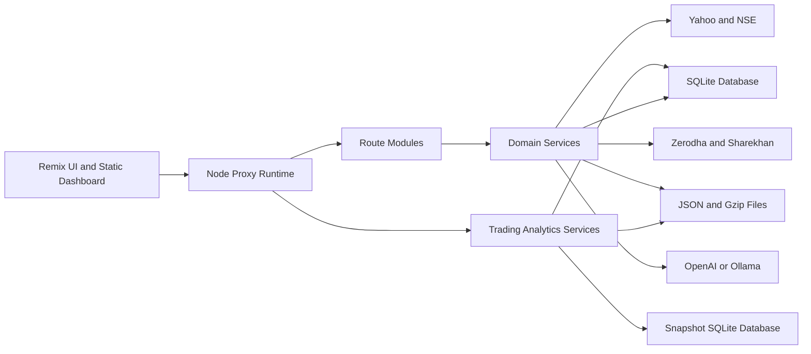
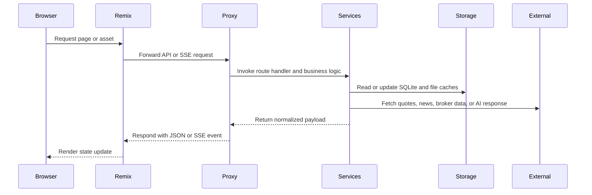

# System Architecture

## System Overview

`stock-watcher` is a single-repository local trading platform with three primary layers:

1. **Presentation** - Remix routes plus legacy dashboard/mobile assets.
2. **Runtime Services** - A Node proxy that exposes APIs, SSE streams, broker integrations, and simulation control.
3. **Persistence and External Data** - SQLite, file-based caches, broker credentials/tokens, and market-data providers.

## Architecture Diagram

### Text Alternative

- The Remix UI and static dashboard talk to a Node proxy runtime.
- The proxy dispatches requests into route modules and shared services.
- Shared services read and write the operational SQLite database plus file-based caches and state files.
- Trading analytics services reconcile trade facts, read the dedicated simulation snapshot database, and create dated strategy-advisor evidence files.
- External integrations include Yahoo Finance, NSE, live brokers, and optional AI endpoints.

## Component Descriptions

### Remix UI and Static Dashboard

- **Purpose**: Renders user-facing screens and provides the browser entry point.
- **Responsibilities**: Serves `/`, `/stocks`, `/etfs`, `/portfolio`, `/replay`, `/mobile`, and associated assets.
- **Dependencies**: `my-remix-app/server.ts`, `my-remix-app/app/routes.ts`, root dashboard/mobile asset files.
- **Type**: Application

### Proxy Runtime

- **Purpose**: Central runtime and integration boundary.
- **Responsibilities**: Hosts core HTTP server, stream clients, runtime scheduler, route registry, and shared dependency wiring.
- **Dependencies**: `ticker_proxy.js`, route modules, broker clients, DB utilities, domain services.
- **Type**: Application

### Route Modules

- **Purpose**: Segment request handling by workflow.
- **Responsibilities**: Dashboard bootstrapping, preferences, broker management, trade execution, replay, and simulation runtime control.
- **Dependencies**: `server/routes/*.js`
- **Type**: Application

### Domain Services

- **Purpose**: Encapsulate market intelligence and persistence-adjacent workflows.
- **Responsibilities**: Fresh news, result calendar, intraday candles, simulation runtime state, HTTP safety, and shared persistence workflows.
- **Dependencies**: `server/*.js`, `server/simulation-domain/index.js`
- **Type**: Shared Service

### Trading Analytics Services

- **Purpose**: Analyze completed trading activity and prepare reproducible strategy evidence.
- **Responsibilities**: Reconcile setup-efficiency and exit-quality facts, calculate period summaries, expose analytics streams, and prepare strategy-advisor evidence packages.
- **Dependencies**: `server/setup-efficiency.js`, `server/exit-quality.js`, `server/strategy-advisor.js`, `server/db.js`
- **Type**: Shared Service

### Snapshot Persistence

- **Purpose**: Store simulation snapshots outside the main operational database.
- **Responsibilities**: Compress snapshot payloads, bucket writes, retain recent history, support worker-thread writes, and migrate legacy snapshot archives.
- **Dependencies**: `server/snapshot-db.js`, `server/snapshot-store.js`, `server/snapshot-writer-worker.js`, `server/migrate-snapshot-files.js`
- **Type**: Data Store

### Broker Adapters

- **Purpose**: Normalize communication with external broker APIs.
- **Responsibilities**: Handle auth tokens, place orders, resolve scrip codes, normalize portfolios, and poll confirmations.
- **Dependencies**: `zerodha-kite-client.js`, `sharekhan-client.js`, `zerodha-confirmation-poller.js`, `sharekhan-ticker.js`
- **Type**: Client

### Persistence Layer

- **Purpose**: Preserve user and runtime state.
- **Responsibilities**: Store trades, symbols, ETF caches, news, runtime status, snapshots, and derived caches.
- **Dependencies**: `server/db.js`, `server/db-migrate.js`, cache and snapshot folders.
- **Type**: Data Store

## Data Flow

### Text Alternative

1. The browser loads a page from Remix.
2. Remix proxies data requests to the Node runtime.
3. The runtime uses route modules and shared services.
4. Services combine local storage with live external integrations.
5. Responses return as JSON or continuous SSE updates.

## Integration Points

- **External APIs**:
  - Yahoo Finance quote and index retrieval.
  - NSE market, board-meeting, announcement, and result feeds.
  - OpenAI and Ollama chat/status endpoints.
- **Databases**:
  - `stock-watcher.db` SQLite database via `better-sqlite3`.
  - `snapshots/simulation_snapshots.db` SQLite database for compressed simulation snapshots.
- **Third-party Services**:
  - Zerodha
  - Sharekhan

## Infrastructure Components

- **Deployment Model**: Local workstation application started with npm scripts; no cloud infrastructure is defined in this repository.
- **Runtime Processes**:
  - Root dev command runs the Remix app and proxy together.
  - The proxy manages child processes for replay workers where needed.
- **Networking**:
  - Local HTTP server with same-origin UI and proxied API routes.
  - Local-only safety checks are applied before request handling.
- **Storage**:
  - Main SQLite database for durable operational state and analytics facts.
  - Dedicated SQLite database for compressed simulation snapshots.
  - JSON and gzip files for legacy persistence, generated reports, and partitioned caches.
