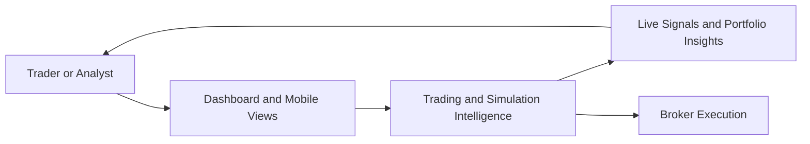

# Business Overview

## Business Context Diagram

### Text Alternative

- Traders and analysts use dashboard and mobile views.
- The application converts live market data, saved preferences, and trading rules into portfolio insights and tradeable signals.
- The same intelligence layer can feed paper trading, simulation, and live broker execution workflows.

## Business Description

- **Business Description**: `stock-watcher` is a local trading workstation for Indian NSE equities and ETFs. It combines live market visibility, trade journaling, broker connectivity, simulation, replay, and event intelligence so a user can monitor setups, manage positions, and review decisions from a single interface.
- **Primary Users**: Active trader, discretionary analyst, and operator reviewing simulations or broker-linked trades.
- **Business Value**:
  - Centralizes live quotes, market breadth, and stock/ETF watchlists.
  - Supports both manual and semi-automated trading workflows.
  - Preserves decision history through trades, day P&L, snapshots, replay, and event caches.
  - Helps evaluate strategy quality with simulation and backtest analysis utilities.

## Business Transactions

1. **Load trading workspace**
   - The UI fetches startup data, preferences, portfolio state, trade history, and first-load market quotes.
2. **Maintain watchlists and favorites**
   - Users save custom stock and ETF universes plus favorites used by the dashboard and mobile views.
3. **Open, close, or partially close trades**
   - The system validates manual trade requests, records state, and optionally routes orders to a broker integration.
4. **Track portfolio and day P&L**
   - The application rebuilds and serves portfolio and daily realized P&L summaries from persisted trade data.
5. **Run server-side simulation**
   - The simulation runtime opens and manages positions from live caches and trading rules using controlled runtime states.
6. **Replay and analyze missed opportunities**
   - Replay routes and worker flows inspect historical setups and missed trades.
7. **Monitor live intraday and market-overview streams**
   - Server-sent event streams push quote, signal, and portfolio changes to connected clients.
8. **Review news and result-calendar events**
   - Fresh-news and result-calendar services classify important corporate events for the tracked universe.
9. **Manage broker login and portfolio sync**
   - Broker routes coordinate authentication, token refresh, and normalized portfolio retrieval for Zerodha and Sharekhan.
10. **Measure setup efficiency**
    - Incremental reconciliation converts closed simulation positions into setup-level performance facts and period summaries.
11. **Assess exit quality**
    - Closed exits are categorized, compared with day-close outcomes, and summarized to quantify protected value and missed opportunity.
12. **Prepare strategy-advisor evidence**
    - The runtime combines effective settings, simulation snapshots, setup efficiency, exit quality, and trade facts into dated evidence packages for external review.
13. **Persist and migrate simulation snapshots**
    - Snapshot archives are written to a dedicated SQLite database, pruned by retention policy, and can be migrated from legacy gzip or JSON files.

## Business Dictionary

- **Trade Execution**: Manual or simulated position lifecycle management exposed through `/trade-execution`.
- **Simulation Runtime**: Server-controlled state machine with `off`, `running`, and `settling` states.
- **Replay**: Historical analysis flow that re-evaluates prior market conditions and missed setups.
- **Fresh News**: Daily cache of impactful announcements and market events filtered for the tracked universe.
- **Result Calendar**: Upcoming earnings and board-meeting intelligence for tracked symbols.
- **Mobile Setups**: Ranked setup candidates optimized for the mobile UI and live intraday review.
- **Paper Trade**: Local trade state that can stay dry-run or represent a live broker-backed workflow.

## Component Level Business Descriptions

### Root Trading Workspace

- **Purpose**: Orchestrates the overall developer and runtime experience for the stock-watching platform.
- **Responsibilities**: Starts the UI and proxy services, hosts static dashboard assets, and contains shared trading logic.

### Remix UI Shell (`my-remix-app`)

- **Purpose**: Presents dashboard, stocks, ETFs, portfolio, replay, and mobile experiences to the user.
- **Responsibilities**: Serves pages and assets, forwards API and SSE traffic to the proxy, and keeps the UI on one origin.

### Proxy and Runtime Core (`ticker_proxy.js`)

- **Purpose**: Acts as the operational heart of the application.
- **Responsibilities**: Hosts HTTP endpoints, coordinates caches and persistence, runs simulations, manages SSE clients, and binds external integrations.

### Backend Route Modules (`server/routes`)

- **Purpose**: Separate major business workflows into focused route handlers.
- **Responsibilities**: Handle dashboard bootstrap, preferences, broker operations, trade execution, replay, and simulation runtime requests.

### Persistence and Supporting Services (`server`)

- **Purpose**: Retain business state and enrich the trading workspace with derived intelligence.
- **Responsibilities**: Manage SQLite state, fresh news, result calendar, intraday candles, snapshots, HTTP safety, and runtime-state persistence.

### Broker Integrations

- **Purpose**: Connect the local workstation to live brokers while preserving a normalized local workflow.
- **Responsibilities**: Authenticate, place orders, refresh tokens, normalize portfolio payloads, and reconcile confirmations.

### Simulation and Replay Domain

- **Purpose**: Evaluate strategy behavior beyond manual execution.
- **Responsibilities**: Apply trading rules, generate simulation decisions, persist snapshots, and support replay analysis.

### Trading Analytics Services

- **Purpose**: Turn completed simulation activity into reproducible performance evidence.
- **Responsibilities**: Reconcile setup-efficiency and exit-quality facts, publish summaries over HTTP and SSE, and prepare dated strategy-advisor evidence without directly changing strategy settings.

### Snapshot Persistence

- **Purpose**: Retain high-volume simulation snapshots efficiently and safely.
- **Responsibilities**: Store gzip-compressed snapshot payloads in SQLite, enforce time buckets and retention, support worker-thread writes, and migrate verified legacy archives.
