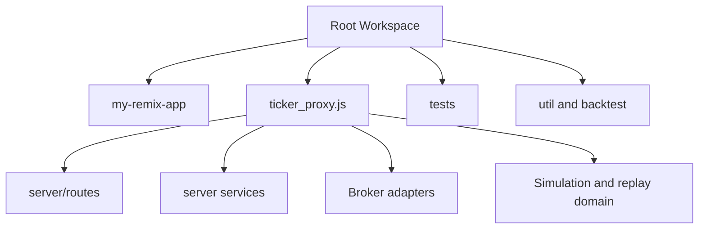

# Code Structure

## Build System

- **Type**: npm with two package manifests
- **Configuration**:
  - Root `package.json` orchestrates proxy, UI, typecheck, and test commands.
  - `my-remix-app/package.json` runs the Remix 3 TypeScript app directly with `node --import remix/node-tsx`.
  - `my-remix-app/tsconfig.json` enables strict TypeScript checking for the UI shell.

## Module Hierarchy

### Text Alternative

- The root workspace contains the main runtime, tests, utilities, and static assets.
- `my-remix-app` is the UI shell.
- `ticker_proxy.js` depends on route modules, services, broker adapters, and simulation domain helpers.

## Existing Files Inventory

### Root Runtime and Shared Logic

- `ticker_proxy.js` - Monolithic proxy runtime, route wiring, caches, SSE, simulation scheduler, and integration coordinator.
- `trade_rules.js` - Shared trading thresholds and rule configuration.
- `simulation_engine.js` - Simulation logic used by runtime flows.
- `backtest_simulation.js` - Backtest-oriented simulation support.
- `replay_worker.js` - Replay background worker.
- `dashboard-app.js` - Main dashboard client logic.
- `mobile-app.js` - Mobile trading UI logic.
- `mobile-sw.js` - Mobile service worker.
- `index.js` - Local broker credential/bootstrap script; currently a security risk because it contains sensitive material.

### Broker and Market Adapters

- `zerodha-kite-client.js` - Zerodha wrapper and portfolio normalization.
- `zerodha-credentials.js` - Zerodha credential loading and token persistence.
- `zerodha-confirmation-poller.js` - Zerodha confirmation reconciliation.
- `sharekhan-client.js` - Sharekhan wrapper and portfolio normalization.
- `sharekhan-credentials.js` - Sharekhan credential loading and token persistence.
- `sharekhan-intraday.js` - Sharekhan intraday data helpers.
- `sharekhan-ticker.js` - Sharekhan ticker pool management.
- `ticker_proxy.js` - Also contains Yahoo and NSE integration endpoints.

### Backend Modules (`server/`)

- `server/db.js` - SQLite initialization, schema management, and persistence APIs.
- `server/db-migrate.js` - Migration from legacy file state into SQLite.
- `server/http-safety.js` - Local-request and JSON-body protection helpers.
- `server/fresh-news.js` - Important-news aggregation and partitioned caching.
- `server/result-calendar.js` - Earnings and board-meeting intelligence service.
- `server/intraday-candles.js` - Intraday candle and signal support.
- `server/snapshot-store.js` - Snapshot storage helpers.
- `server/snapshot-db.js` - Dedicated SQLite snapshot database with compressed payloads and retention queries.
- `server/snapshot-writer-worker.js` - Worker-thread snapshot writer.
- `server/migrate-snapshot-files.js` - Verified migration from legacy JSON/gzip snapshot archives.
- `server/simulation-runtime-store.js` - Runtime-state persistence and transition rules.
- `server/simulation-domain/index.js` - Simulation domain orchestration entry point.
- `server/concurrency.js` - Bounded asynchronous mapping helper.
- `server/setup-efficiency.js` - Incremental setup-performance reconciliation and summaries.
- `server/exit-quality.js` - Exit categorization, day-close benchmarking, and quality summaries.
- `server/strategy-advisor.js` - Dated strategy evidence preparation and file-backed result discovery.

### Route Handlers (`server/routes/`)

- `server/routes/dashboard.js` - Health, bootstrap, market, and mobile read models.
- `server/routes/preferences.js` - Saved symbols and favorites APIs.
- `server/routes/broker.js` - Broker mode, status, auth, and portfolio routes.
- `server/routes/trade-execution.js` - Trade CRUD, live-order initiation, and trade SSE.
- `server/routes/trade-settings.js` - Trading settings persistence.
- `server/routes/replay.js` - Replay status and analysis routes.
- `server/routes/simulation-runtime.js` - Simulation runtime control and snapshots.
- `server/routes/setup-efficiency.js` - Setup-efficiency read, reconciliation, date analysis, and SSE endpoints.
- `server/routes/exit-quality.js` - Exit-quality read, reconciliation, date analysis, and SSE endpoints.
- `server/routes/strategy-advisor.js` - Strategy-advisor evidence preparation, status, and SSE endpoints.
- `server/routes/registry.js` - Route registration and dispatch glue.

### Remix App (`my-remix-app/`)

- `my-remix-app/server.ts` - Remix server bridge with proxy forwarding and SSE handling.
- `my-remix-app/proxy-routes.ts` - Declares which paths are forwarded to the proxy.
- `my-remix-app/app/routes.ts` - Route mapping for dashboard, stocks, ETFs, portfolio, replay, and mobile views.
- `my-remix-app/app/router.ts` - Router setup.
- `my-remix-app/app/actions/controller.tsx` - UI controller/action orchestration.
- `my-remix-app/app/assets.ts` and `app/assets/*` - Asset bootstrapping for the UI shell.
- `my-remix-app/app/ui/*` - Document and scaffold view helpers.

### Utilities and Research

- `util/get_zerodha_tokens.py` - Python utility for Zerodha token flow.
- `util/sharekhan_login.py` - Python helper for Sharekhan login workflow.
- `util/populate-custom-stock-sectors.js` - Utility for custom sector metadata.
- `backtest/analysis/*.js` - One-off strategy and parameter analysis scripts.
- `benchmark/engine_performance.js` - Performance benchmarking helper.

### Test Surface

- `tests/*.test.js` - Root regression suite covering DB, SSE, dashboard/mobile behavior, broker flows, simulation, replay, and route contracts.
- `my-remix-app/proxy-routes.test.ts` - Remix proxy path unit test.

## Design Patterns

### Central Dependency-Wired Runtime

- **Location**: `ticker_proxy.js`
- **Purpose**: Keeps one runtime responsible for stateful coordination.
- **Implementation**: Shared helpers and dependencies are created once and passed into route handlers.

### Route-Module Segmentation

- **Location**: `server/routes/*.js`
- **Purpose**: Breaks large HTTP behavior into workflow-based handlers.
- **Implementation**: Each module exports one handler function that returns whether it handled the request.

### Normalized External Adapters

- **Location**: `zerodha-kite-client.js`, `sharekhan-client.js`
- **Purpose**: Shield the rest of the system from broker-specific response shapes.
- **Implementation**: Wrapper methods normalize portfolio data and order flows.

### Hybrid Persistence

- **Location**: `server/db.js`, `server/db-migrate.js`, file caches under `cache/` and `snapshots/`
- **Purpose**: Preserve current operational state while supporting legacy files and large snapshot artifacts.
- **Implementation**: The main SQLite database stores operational and analytics state, a dedicated SQLite database stores compressed simulation snapshots, and JSON files remain for generated evidence and partitioned caches.

### Incremental Analytics Reconciliation

- **Location**: `server/setup-efficiency.js`, `server/exit-quality.js`, `server/db.js`
- **Purpose**: Avoid full rescans while keeping derived analytics reproducible.
- **Implementation**: Reconciliation cursors track the last processed trade update and rebuild affected facts and summaries transactionally.

### Background Snapshot Writes

- **Location**: `server/snapshot-writer-worker.js`, `ticker_proxy.js`
- **Purpose**: Keep snapshot compression and persistence from blocking the main runtime.
- **Implementation**: Worker threads append compressed, time-bucketed snapshots to a WAL-enabled SQLite database.

## Critical Dependencies

### Root Runtime

- **Dependencies**: `axios`, `better-sqlite3`, `kiteconnect`, `sharekhan-api`, `npm-run-all`
- **Purpose**: HTTP calls, SQLite persistence, broker integration, and concurrent local dev.

### Remix App

- **Dependencies**: `remix`, `typescript`, `@types/node`
- **Purpose**: Route rendering, TypeScript execution, and type checking.
