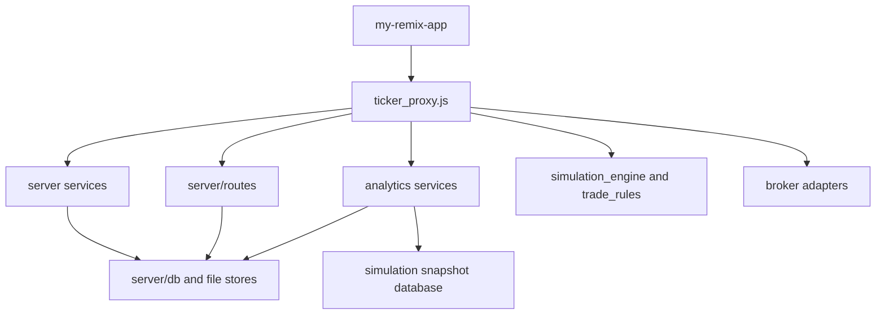

# Dependencies

## Internal Dependencies

### Text Alternative

- The Remix UI depends on the proxy for all dynamic data.
- The proxy depends on route modules, services, broker adapters, and shared trading logic.
- Route modules and services depend on SQLite and file-backed storage helpers.
- Analytics services depend on operational trade facts and the dedicated simulation snapshot database.

### UI depends on Proxy

- **Type**: Runtime
- **Reason**: The UI forwards API and SSE traffic to the proxy runtime.

### Proxy depends on Route Modules

- **Type**: Runtime
- **Reason**: Request handling is segmented by business workflow.

### Proxy depends on Shared Services

- **Type**: Runtime
- **Reason**: Domain services provide market intelligence, caching, and persistence support.

### Proxy depends on Broker Adapters

- **Type**: Runtime
- **Reason**: Trade execution and portfolio sync require broker-specific integrations.

### Route Modules and Services depend on Storage

- **Type**: Runtime
- **Reason**: Trade state, preferences, event caches, and snapshots must be persisted.

### Analytics Services depend on Operational and Snapshot Storage

- **Type**: Runtime
- **Reason**: Setup efficiency and exit quality use operational trade records, while strategy-advisor evidence also consumes compressed simulation snapshots and dated report files.

## External Dependencies

### axios

- **Version**: `^1.18.1`
- **Purpose**: Outbound HTTP requests
- **License**: See upstream package metadata

### better-sqlite3

- **Version**: `^12.11.1`
- **Purpose**: Local SQLite persistence
- **License**: See upstream package metadata

### kiteconnect

- **Version**: `^5.3.0`
- **Purpose**: Zerodha API integration
- **License**: See upstream package metadata

### sharekhan-api

- **Version**: `github:Sharekhan-API/shareconnectnodejs`
- **Purpose**: Sharekhan API integration
- **License**: See upstream repository metadata

### remix

- **Version**: `^3.0.0-beta.4`
- **Purpose**: UI framework and server bridge
- **License**: See upstream package metadata

### typescript

- **Version**: `latest`
- **Purpose**: Type checking for the Remix app
- **License**: See upstream package metadata

### @types/node

- **Version**: `latest`
- **Purpose**: Node.js type definitions for the Remix app
- **License**: See upstream package metadata

### npm-run-all

- **Version**: `^4.1.5`
- **Purpose**: Parallel local development scripts
- **License**: See upstream package metadata

## Additional Dependency Notes

- Python utilities use the Python `kiteconnect` package, but no repository-managed Python dependency manifest was found.
- The repository contains a nested npm project (`my-remix-app`) in addition to the root package.
